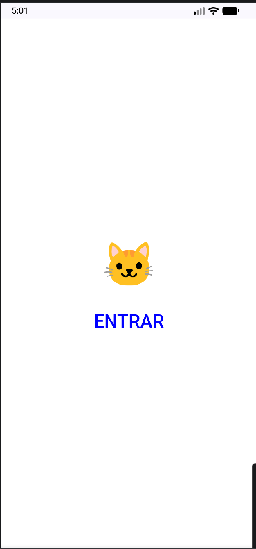
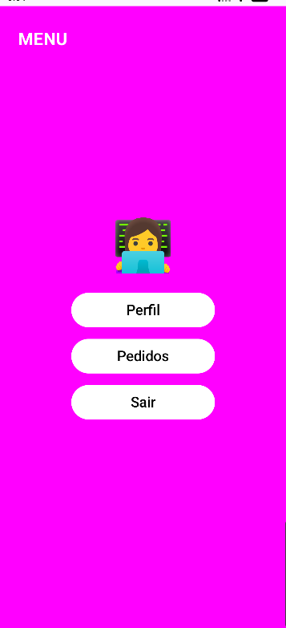
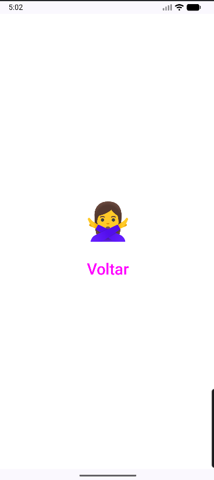

# 📱 Projeto de Navegação Android

Este projeto foi desenvolvido utilizando **Kotlin** e **Jetpack Compose** no Android Studio.  
O objetivo é demonstrar a implementação de **navegação entre telas** em um aplicativo Android utilizando **Navigation Compose**.

## 🔁 Fluxo de navegação

O aplicativo possui quatro telas principais:

- Login
- Menu
- Pedidos
- Perfil

## 🖥️ Telas do aplicativo

### Tela de Login

Aqui o usuário pode acessar o aplicativo através do botão **Entrar**.

---

### Tela de Menu

Após entrar, o usuário acessa o menu principal com opções de navegação.

---

### Tela de Perfil voltar

---

### Tela de Pedidos voltar

---

